<h1 align="center">Traveling Fan Problem! </h1>
<p align="center">
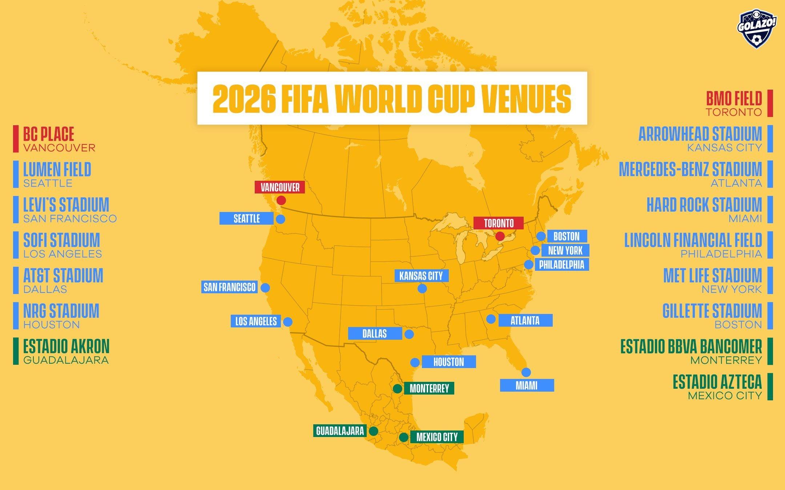
</p>
<h3 align="center">maximizing the number of matches! ✨</h3>


<p align="center">

</p>

## Introduction


### What is the Traveling Fan Problem?

The Traveling Fan Problem (TFP) is a unique optimization challenge inspired by the excitement and fervor surrounding major sporting events, particularly the FIFA World Cup. Imagine a passionate fan who dreams of attending every match of the tournament, which in this case, the FIFA World Cup 2026 held across multiple countries - the United States, Mexico, and Canada. Unlike previous World Cup where stadiums were relatively close (Longest distance to travel between World Cup Qatar 2022 stadiums was 55km), the 2026 edition presents a significant logistical challenge due to the vast distances between venues. The objective of the Traveling Fan Problem is to devise an efficient itinerary for our avid supporter, maximizing the number of matches attended while minimizing travel time and distance.

### Genetic Algorithm (GA) Overview

To tackle the Traveling Fan Problem, we employ a Genetic Algorithm (GA), a powerful heuristic search technique inspired by the principles of natural selection and genetics. GAs are part of a broader class of algorithms known as Evolutionary Algorithms, which mimic the process of natural evolution to solve complex optimization problems. They are particularly well-suited for addressing optimization problems where traditional exact methods become computationally infeasible, as is often the case with large-scale combinatorial problems like the Traveling Salesman Problem (TSP), which shares similarities with our Traveling Fan Problem.

In our implementation, the GA starts with a population of potential solutions, each representing a unique itinerary for our traveling fan. Through successive generations of evolution, involving processes such as selection, crossover, and mutation, the algorithm iteratively refines these solutions, gradually converging towards an optimal or near-optimal itinerary. By leveraging the power of evolution-inspired search, our GA, as a part of evolutionary algorithms, offers a practical and scalable approach to addressing the complex logistical challenges posed by the Traveling Fan Problem.

## Table of Contents

1. [Problem Formulation](#problem-formulation)
   
2. [Evolution from Problem to Game](#evolution-from-problem-to-game)
   - [Solving the Real Problem](#solving-the-real-problem)
   - [Designing the Interface](#designing-the-interface)
   - [Implementing Gameplay Features](#implementing-gameplay-features)
   - [Real-Time Feedback and Information](#real-time-feedback-and-information)
   - [Theme Selection](#theme-selection)
     
3. [Solution Description - Genetic Algorithm (EA)](#Solution-Description)
   - [Overview](#overview)
   - [Key Components](#key-components)
   - [Usage](#usage)
     
4. [Evolutionary Analysis And Experimentation](#evolutionary-analysis-and-experimentation)
   
5. [Conclusion](#conclusion)
   
6. [Code](#code)
   - [Files Description](#files-description)
   - [Important Functions](#important-functions)
     
7. [Installation And Running Instructions](#installation-and-running-instructions)


## Problem Formulation


The Traveling Fan Problem (TFP) is an optimization challenge centered around a passionate fan's desire to attend matches at multiple stadiums, typically during a major sports event such as the FIFA World Cup. The objective is to plan an itinerary that allows the fan to visit each of the 16 stadiums while minimizing travel distance.

### Data Gathered

For the Traveling Fan Problem project, the following data has been gathered:

#### Stadiums
- SoFi Stadium: Located at (33.9535° N, -118.3391° W)
- MetLife Stadium: Located at (40.8136° N, -74.0746° W)
- AT&T Stadium: Located at (32.7482° N, -97.0926° W)
- Hard Rock Stadium: Located at (25.9585° N, -80.2384° W)
- Arrowhead Stadium: Located at (39.0491° N, -94.4836° W)
- Mercedes-Benz Stadium: Located at (33.7554° N, -84.4005° W)
- Gillette Stadium: Located at (42.0910° N, -71.2639° W)
- NRG Stadium: Located at (29.6850° N, -95.4104° W)
- Lincoln Financial Field: Located at (39.9015° N, -75.1675° W)
- Levi's Stadium: Located at (37.4035° N, -121.9690° W)
- Lumen Field: Located at (47.5952° N, -122.3316° W)
- Azteca Stadium: Located at (19.3030° N, -99.1501° W)
- Estadio Akron: Located at (20.6819° N, -103.4624° W)
- Estadio BBVA: Located at (25.6693° N, -100.2440° W)
- BMO Field: Located at (43.6334° N, -79.4183° W)
- BC Place: Located at (49.2768° N, -123.1113° W)

#### Distance Matrix
A distance matrix has been generated, providing the distances between each pair of stadiums. This matrix aids in determining the travel distances and optimizing the fan's itinerary for attending matches.

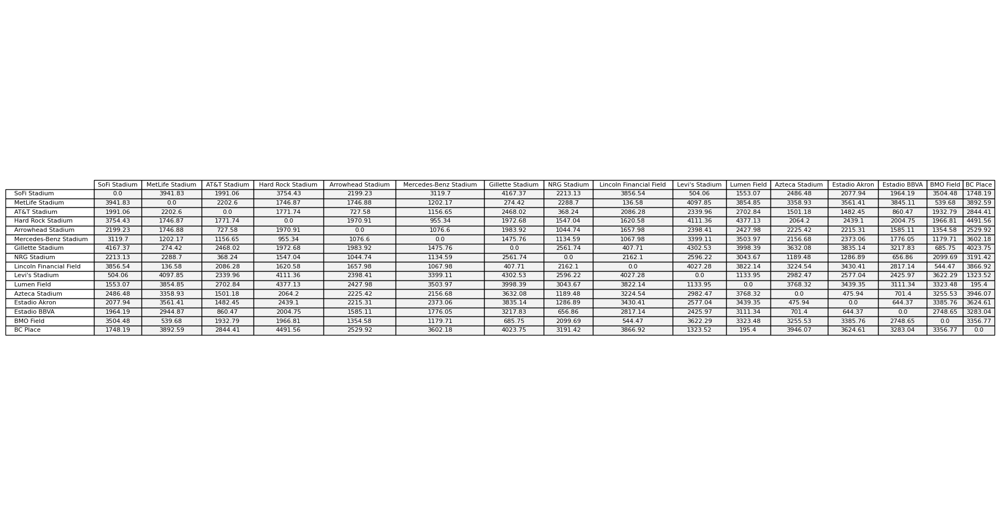


## Evolution from Problem to Game

### Solving the Real Problem:
We began by tackling the TFP head-on, leveraging the power of a genetic algorithm to find the optimal itinerary for attending matches at stadiums across different cities or countries. With careful planning and strategic thinking, we achieved success in optimizing the fan's journey.

### Designing the Interface:
The game's interface was crafted to mirror the journey of the traveling fan. On the home page, players are greeted with the real-world locations of stadiums, setting the stage for their adventure. The dynamic display showcases the stadiums' names.

### Implementing Gameplay Features:
- Key gameplay features were introduced to enhance the player experience:
    - To start the algorithm, press the spacebar or a designated "Continue" button. This initiates the optimization process, allowing players to witness the algorithm in action as it searches for the optimal solution.
    - To open the side bar and access additional functionalities, press the Enter key.
    - To exit the game, press the Escape key.

- A "Generate" button allows users to generate random stadium locations, triggering the algorithm to solve the new problem. A "Reset" button enables players to revert to the original data, while a "Select" button empowers them to adjust the number of generations for the algorithm.

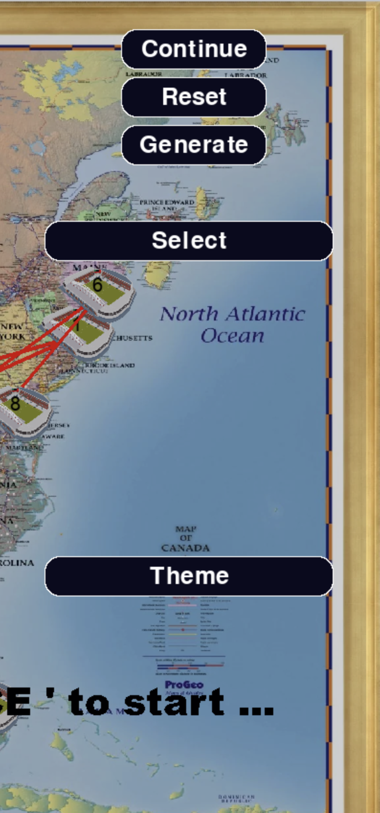

### Real-Time Feedback and Information:
- Throughout the game, players are provided with real-time feedback and information. The display continuously updates with essential details such as the current generation number, the number of limited generations, and the best distance achieved so far.
- Also for developers there will be a way to see results throw output file with name **output.txt**. 

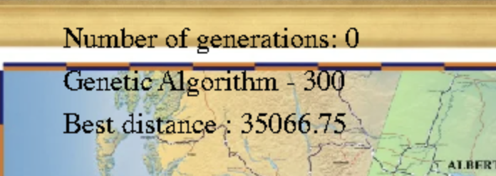

### Theme Selection:
To further enhance player immersion, a "Theme" button allows users to choose the background theme of the game. Players can select from a variety of visually captivating themes to customize their gaming experience.

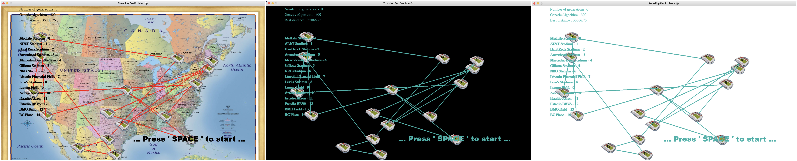

### Note: 
The default limited Generation will be 300, Population Size also 300, and Mutation Probability will be 0.02 (more on that later)


## Solution Description - Genetic Algorithm (EA)

### Overview:
The Genetic Algorithm (GA), a fundamental component of **evolutionary algorithms**, offers a powerful solution to the Traveling Fan Problem (TFP). This algorithm aims to optimize the itinerary of a fan attending matches at multiple stadiums while minimizing travel time and distance. By leveraging principles of natural selection and genetic operations, the GA efficiently explores and evolves potential solutions to find the optimal route.

### Key Components:
- Population Generation:
The algorithm initializes a population of genomes, each representing a potential itinerary. These genomes are randomly generated, ensuring diversity in the initial population.

- Fitness Evaluation:
A fitness function evaluates the quality of each genome by computing its total travel distance based on a given distance matrix. The lower the distance, the higher the fitness of the genome.

- Selection and Reproduction:
Through a process inspired by natural selection, the algorithm selects the fittest genomes from the population to serve as parents for the next generation. Genetic operations such as crossover and mutation are then applied to produce offspring with variations from their parents.

- Evolution and Optimization:
Successive generations undergo evolution as the algorithm iteratively selects, reproduces, and evolves genomes towards better solutions. This iterative process continues until a termination condition is met, such as reaching a specified number of generations or achieving a desired level of optimization.

### Usage:

- Game Integration:
The run function is specifically designed for integration into the game. It progresses the algorithm step by step, providing real-time feedback to the player regarding the optimization process.

- Evolutionary Analysis:
For evolutionary analysis and experimentation, the run_evolution function is available. This function executes the algorithm for a specified number of generations, allowing researchers to study the algorithm's performance under different conditions such as varying generation limits and mutation probabilities.

### Note:
The algorithm's performance can be further optimized and customized by adjusting parameters such as population size, mutation probability, and generation limit.


## Evolutionary Analysis And Experimentation


Results of running the genetic algorithm on the real stadium data are presented below for different generation limits, population size and mutation probabilities. The algorithm was executed **15 times**, and the results are averaged to provide a representative outcome. The results displayed are from the **10th**.
The real reason behind these experiments is written in the **note** above ☺  

### We start by examining different limited generation:

**Note** : number of populations is 100. 

1) **100 Limited Generation:**

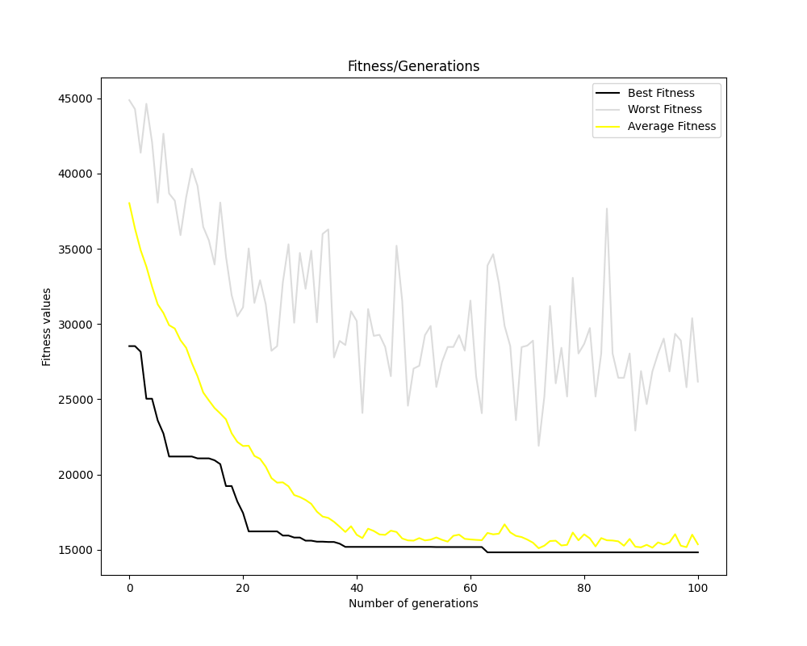

2) **500 Limited Generation:**

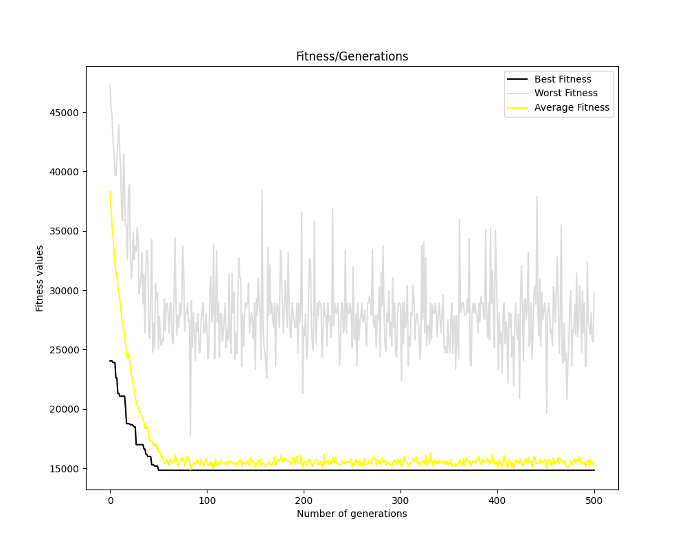

3) **1000 Limited Generation:**

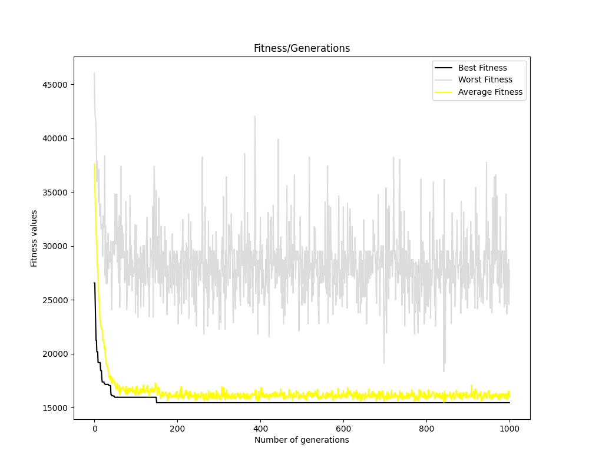

  
### Next Step: change the population size

**Note** : number of Limited Generation is 300 (default of the game).

1) **100 Population Size:**


<p align="center">Best Distance = 15561.310000000001</p>

2) **300 Population Size:**

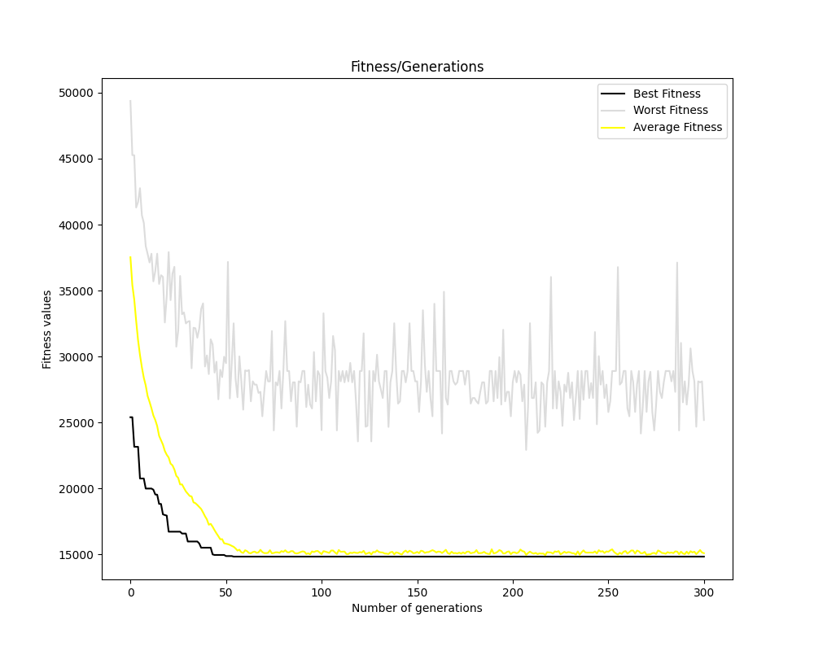
<p align="center">Best Distance = 14827.61 <br/> cֹonverging to best on generation ~ 46 </p>


3) **500 Population Size:**

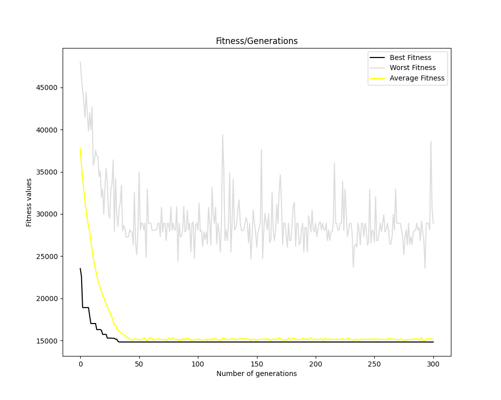
<p align="center">Best Distance = 14827.61 <br/> cֹonverging to best on generation ~ 39 </p>

### Last Step: find best mutation probability:

**Note** : number of Limited Generation is 300 (default of the game), and population size is 300.

1) **0.02 Mutation Probability:**

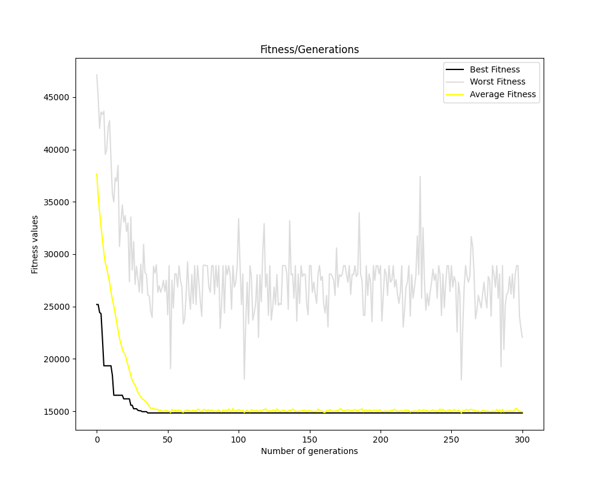
<p align="center">Best Distance = 14827.61 <br/> cֹonverging to best on generation ~ 39 </p>

2) **0.06 Mutation Probability:**

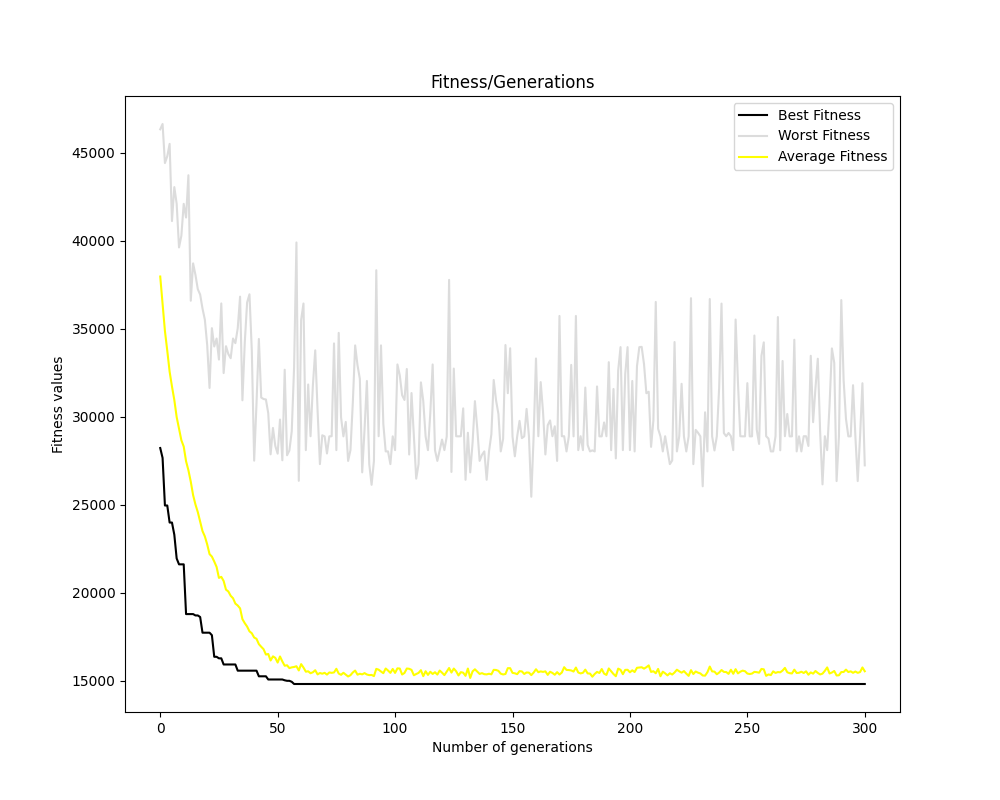
<p align="center">Best Distance = 14827.61 <br/> cֹonverging to best on generation ~ 60 </p>


3) **0.09 Population Size:**

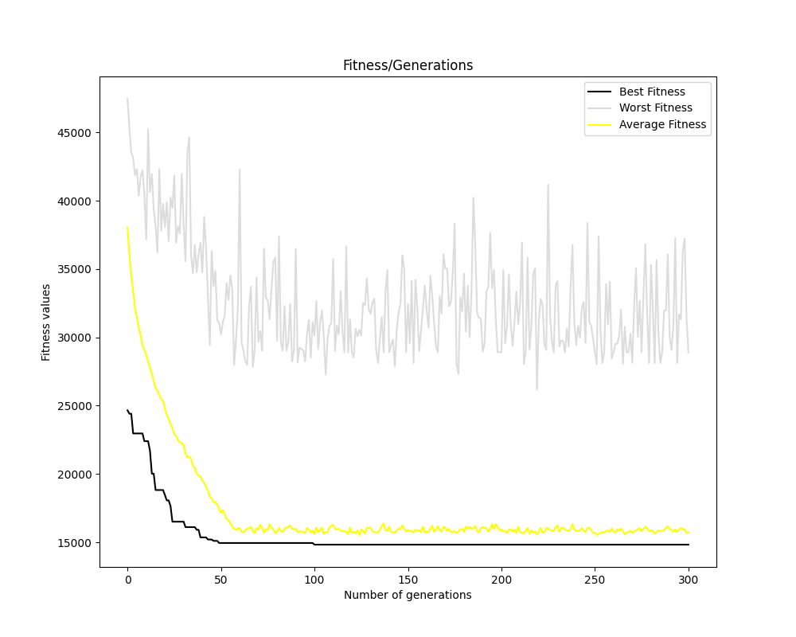
<p align="center">Best Distance = 14827.61 <br/> cֹonverging to best on generation ~ 105 </p>


## Conclusion


Through systematic experimentation with different parameters in the genetic algorithm, we aimed to find the most efficient configuration for solving the Traveling Fan Problem (TFP) using real stadium data. The results of our investigation shed light on the impact of limited generation, population size, and mutation probability on the algorithm's performance.

- ### Population Size Variation
  The population size played a crucial role in the algorithm's performance. Smaller populations, such as 100, exhibited slower convergence and often resulted in suboptimal solutions. Conversely, larger populations, such as 500, accelerated convergence, leading to improved solutions in fewer generations. Notably, a population size of 300 struck a balance between computational efficiency and solution quality, converging to the best route in approximately 39 to 46 generations.

- ### Mutation Probability Assessment
  Exploring different mutation probabilities revealed varying impacts on convergence speed and solution quality. Lower mutation probabilities, such as 0.02, facilitated faster convergence to the optimal route within approximately 39 generations. On the other hand, higher mutation probabilities, such as 0.06 and 0.09, delayed convergence, requiring more generations to reach the best solution.

- ### Recommendations
  Based on our experimentation, we recommend the following configuration for optimal performance in solving the TFP:

  1) Population Size: Maintain a population size of around 300 for a balance between convergence speed and solution quality.
  2) Mutation Probability: Opt for a lower mutation probability, such as 0.02, to expedite convergence without sacrificing solution quality.
  
  By adhering to these recommendations, users can leverage the genetic algorithm effectively to efficiently solve the TFP and plan optimal itineraries for attending matches at multiple stadiums.
  

## About The Code:

### Overview:

The application utilizes Pygame for visualization purposes and employs an object-oriented approach to implement and manage the genetic algorithm, ensuring effective route optimization.

### Files Description: 
- **manager.py:**
Contains the Manager class responsible for managing the main logic of the program, including handling the genetic algorithm, rendering the graphical interface, and managing user interactions.

- **genetic_algo.py:**
Implements the genetic algorithm for solving the Traveling Fan Problem.
Defines the Genetic class, which contains methods for generating populations, evolving generations, and calculating fitness scores.

- **stadium.py:**
Defines the Stadium class, representing individual stadium locations.
Contains methods for drawing stadiums on the screen and calculating distances between stadiums.

- **utils.py:**
Provides various utility functions used throughout the program, including distance calculations, coordinate scaling, and matrix creation.

- **data.stadiums_data.py:**
Contains predefined data related to stadium locations, distances between stadiums, and stadium names.
Used for initializing stadium objects and providing input data for the genetic algorithm.

- **data.colors.py:**
Defines color constants used for rendering graphics.

- **data.constants.py:**
Contains constants such as screen dimensions, population size, mutation probabilities, and line thickness.

- **main.py:**
The main entry point of the program.
Initializes the pygame environment, creates a Manager instance, and handles the main game loop.

- **UI.init_ui.py:**
Initializes the user interface components, including buttons and panels, using pygame.

- **UI.ui.py:**
Defines classes for UI elements such as buttons, panels, and dropdowns.

### Important Functions

- **Genetic Algorithm Functions:**

  - **generate_population():** Generate initial populations for the genetic algorithm.
  - **run():** Execute the genetic algorithm to evolve populations over generations.
  - **fitness():** Calculate the fitness score for a given solution or individual.
  
- **Rendering and Visualization Functions:**
  - **draw_stadiums():** Render stadium locations on the screen.
  - **draw_shortest_path():** Draw the shortest path found by the genetic algorithm.
  - **text():** Display statistics and information on the screen.
  
- **Utility Functions:**
  - **distance():** Calculate the distance between two points.
  - **create_distance_matrix():** Create a distance matrix based on stadium locations.
  - **find_offset():** Determine scaling offsets for coordinate conversion.
  - **scale_coordinates():** Scale coordinates from a manual coordinate system to match screen dimensions.

- **User Interface Functions:**
  - **Button:** Class for creating clickable buttons with customizable properties.
  - **Panel:** Class for creating panels to organize UI elements.
  - **DropDownButton:** Class for dropdown buttons allowing selection from multiple options.
  
- **Data Files:**
  Real data that we collected


## Installation And Running Instructions:


1. **Clone the Repository:**
```shell
git clone https://github.com/hamudib12/Traveling-Fan-Problem
cd Traveling-Fan-Problem
```

2. **Install Dependencies:**
```shell
pip install -r requirements.txt
```

3. **Run the Application:**
```shell
python main.py
```

#### or:

1. **Clone the Repository:**
```shell
git clone https://github.com/hamudib12/Traveling-Fan-Problem
cd Traveling-Fan-Problem
```

2. **Setup Virtual Environment:**
```shell
python -m venv .venv
source .venv/bin/activate # On Windows use: .venv\Scripts\activate
```

3. **Install Dependencies:**
```shell
pip install -r requirements.txt
```

4. **Run the Application:**
```shell
python main.py
```

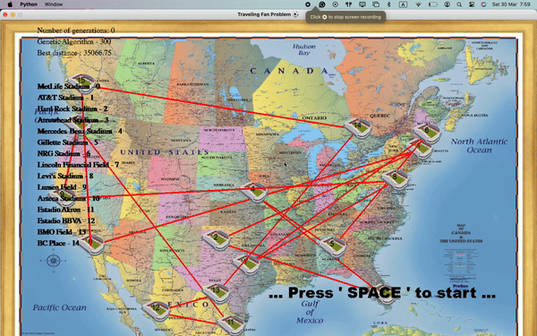

